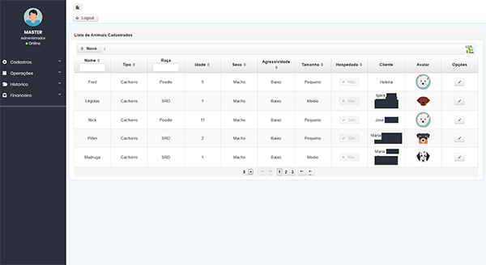
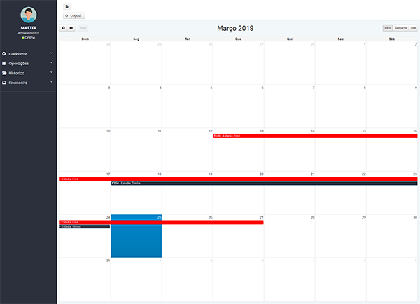
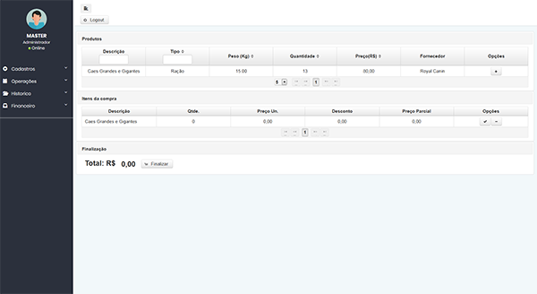
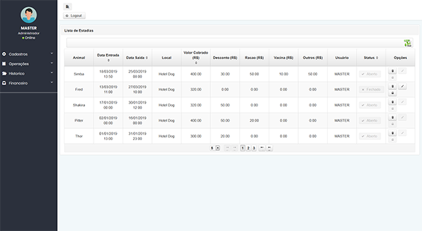

# SysDog 0.1

Sistema de Gerenciamento de Hospedaria de animais

## Descrição

Este sistema foi desenvolvido em 2017 para uso de um cliente que precisava de gerenciar uma hospedaria, agora
tendo em vista ajudar outros desenvolvedores hospedei aqui o codigo-fonte usado no desenvolvimento.

Telas de cadastros de Usuários,Clientes,Animais,Produtos,Fornecedores,Locais



Operaçõess de Criação de estadias dos animais cadastrados usando o calendar



Sistema de compra e venda de produtos (Sem emitir NF)



Sistema de Historico onde comprovantes podem ser impressos



### Manual

Para melhor entendimento das funções do sistema use o PDF:

* [SysDog01.pdf](https://drive.google.com/file/d/1HZhjSEavL59AoQievFgfQgtus6e4iWTJ/view?usp=sharing)

### Requisitos

Este sistema atualmente roda com o MariaDB 10.x e Apache 9.0

### Instalação

Para usar pela primeira vez execute os seguintes passos: 

```
Usando seu gerenciador de BD crie o Banco de dados "sysdog"
```
```
Dentro do projeto navegue até a pasta src/test/java
```
```
No pacote com.esl.test execute o arquivo ConfiguracaoInical.java com "run as..." , "Junit Test"
```
```
Este arquivo contem o método que executará a criação das tabelas e inserção de dois usuarios 
e outros dados para maiores informações, veja os dados contidos na classe.
```
```
Agora basta executar o sistema com o Apache, os logins colocados para exemplo são

login: adr  senha: aaa     Funcionario
login: maj  senha: ccc     Administrador
```

## Testes

Neste sistema eu usei o JUnit para testar métodos durante a fase de desenvolvimento.
elas estão na pasta src/test/java

## Bugs

Esse sistema foi testado no navegador Mozzila Firefox, em teste no Chrome foram observados
algumas falhas de renderizão do login mas que não afetam as funções do sistema, provalvemente
causadas pelo interação bootstrap com Primefaces. 

## Softwares Usados


* [Primefaces 6.1](https://www.primefaces.org/) - Gerenciamento da interface JSF
* [Bootstrap](https://getbootstrap.com/) - CSS utilizado
* [MariaDB 10.x](https://mariadb.org/) - Banco de dados usado
* [Maven](https://maven.apache.org/) - Gerenciamento de dependências
* [Apache 9.0](https://www.apache.org/) - Servidor usado
* [JasperSoft](https://community.jaspersoft.com/download) - Criação de relatórios


## Versão

A versão colocada aqui é a usada durande o desenvolvimento sendo considerada versão beta 0.1

## Sobre o Projeto

* Este sistema foi o primero desenvolvido por mim, então aprendi bastante para conseguir finaliza-lo
espero que o código-fonte possa lhe ajudar 
* Todas as tabelas usam o modo Lazy inclusive o Calendario usado na parte de estadias tambem estão no modo lazy
, conseguir um exemplo foi bem dificil.

## Futuro

* Com o tempo pretendo atualizar toda a parte grafica do projeto, a combinação Bootstrap + primefaces é bem complicada
, com isso pretendo migrar para o AdminFaces.
* A parte da segurança foi feita manualmente com uso do PhaseListener, não é o ideal hoje em dia, mas como era um sitema 
para uso interno foi adotado, atualmente estudo a troca pelo Apache Shiro ou Spring Security
* A parte de imagens foi feita com uso de avatares com imagens armazendas no proprio projeto o que não é uma boa prática,
em uma versão futura pode se adotar uso do Amazon S3 para armazenamento
* O cliente optou por não usar Gráficos interativos(Charts) mais o o mesmo poderá ser usado em outras versões

## Referências

As seguintes referências foram usadas no densenvolvimento desse projeto

* [Programação web com java - Sergio Roberto delfino] (https://www.youtube.com/watch?v=9PGp1T242hA&list=PL_GwGUsBlNyfI0W3ggfffhBdJUqB4981Z)

## Autor

* **Eliederson Linhares**  - (https://github.com/EliedersonLinhares)
*   Email: eliederson210@outlook.com


## Licensa

Este projeto estará sobre a licensa MIT.
